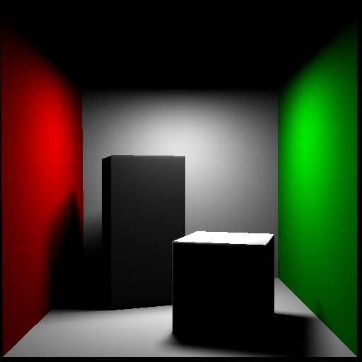
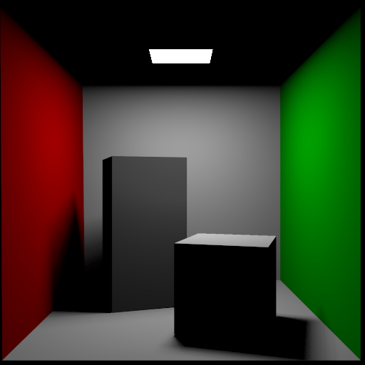
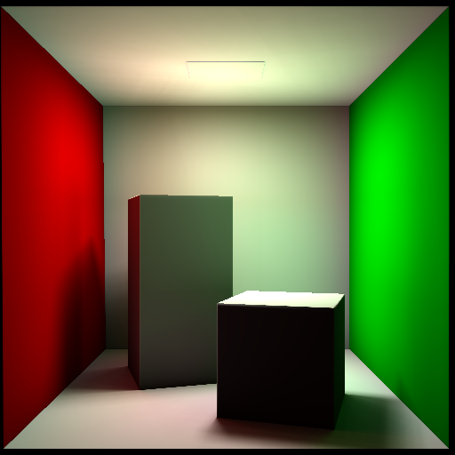
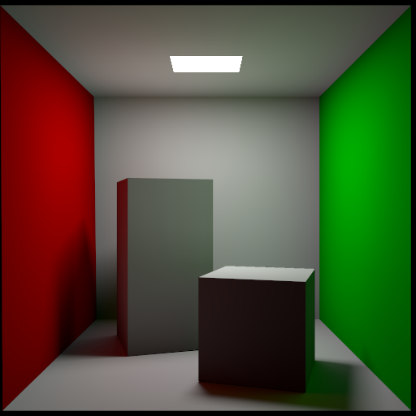
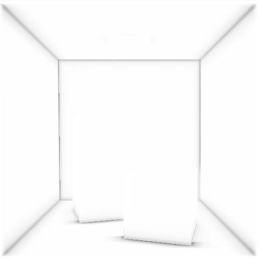
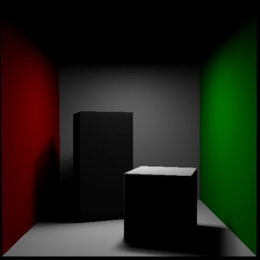
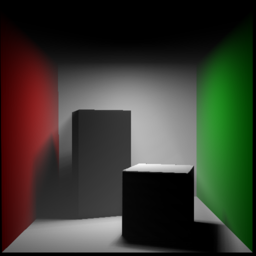

## Some (simple) global illumination algorithms

### Instant radiosity implemented by virtual point lights

Note: This project is almost finished, although the shaders are a little bit problematic -- the attenuation function of VPL (`draw_with_shadow.fs.glsl`) needs to be fine-tuned.

TODO: tidy up the code.

-----

Direct lighting

Mitsuba reference result (max depth = 2)

4096 samples with VPLs

Mitsuba reference result(max depth = 3, Samples per pixel = 4096)

### Screen space ambient occlusion

TODO: 
* how to handle the normal when it's back to the camera  
* test on more scenes.

-----

### Participating Media

Reference paper: [Real-time Volumetric Lighting in Participating Media (EG'09)](http://sirkan.iit.bme.hu/~szirmay/lightshaft.pdf)

No participating media

With participating media

Note the scattering effect in the shadowed area.