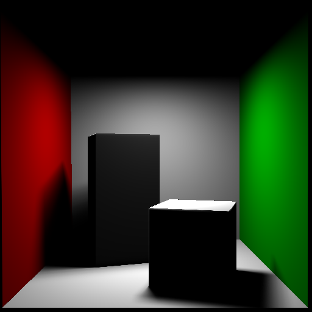

##### Instant radiosity implemented by virtual point lights

Note: This project is almost finished, although the shaders are a little bit problematic -- the attenuation function of VPL (`draw_with_shadow.fs.glsl`) needs to be fine-tuned.

Direct lighting

4096 samples with VPLs

